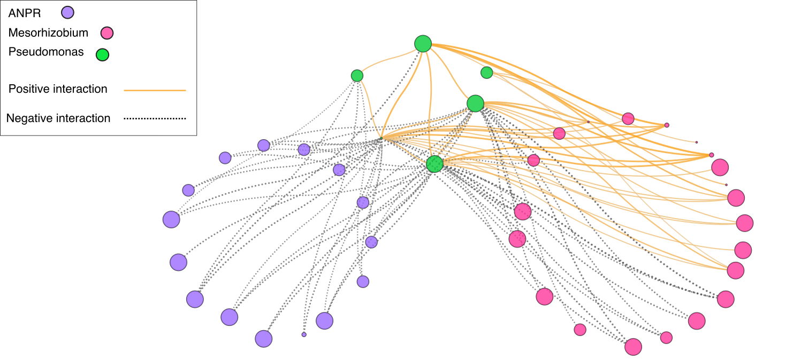

# LotusNodules

This repository contains data and scripts used to explore the relationship between the nodule microbiome and nodulation, influenced by the soil microbiome, in **Lotus species**. Using a metabarcoding approach, we characterized the communities within nodules of healthy and starved plants. A machine learning algorithm and network analyses were employed to identify key nodule bacteria, which were then re-inoculated onto plants in controlled conditions to assess their functionality.

The findings are detailed in the paper:  
**"Microbiome profiling reveals that Pseudomonas antagonises parasitic nodule colonisation of cheater rhizobia in Lotus"**, [*New Phytologist*](https://nph.onlinelibrary.wiley.com/doi/full/10.1111/nph.17988) 

Scripts are authored by **Maryam Mahmoudi**.

---

---

## Features
- **Comprehensive Data**: Includes data for machine learning feature importance and microbial network analyses.  
- **Reproducible Scripts**: Jupyter Notebooks for building SVM models and generating network visualizations.  
- **Detailed Results**: Input and output data for figures in the manuscript.

---

## Quick Start Guide

1. Clone the repository:  
   ```bash
   git clone https://github.com/IshtarMM/LotusNodules.git
   cd LotusNodules
   ```

2. Set up a Python environment with the required dependencie
   

3. Navigate to the relevant folders for each figure and run the scripts:
   - **`fig5/`**: Scripts and data for SVM analysis and feature importance.
   - **`fig6/`**: Scripts and data for microbial network analysis.
   - **`fig_s6/`**: Supplementary figure for network analyses.

4. Run the Jupyter Notebooks to reproduce analyses. Example for Figure 5:  
   ```bash
   jupyter notebook fig5/script/SVMmodel.ipynb
   ```

---

## Repository Structure

### Main Folders
- **`fig5/`**: Contains data and scripts for generating Figure 5.  
  - **data/**: Input files for SVM analysis, including feature importance data.  
  - **script/**: `SVMmodel.ipynb` notebook for training and evaluating the SVM model.

- **`fig6/`**: Contains data and scripts for generating Figure 6.  
  - **data/**: Input files for microbial network construction and analysis.  
  - **script/**: `network_figure6.ipynb` notebook for network analysis and visualization.

- **`fig_s6/`**: Contains supplementary data and scripts for generating Figure S6.  
  - **data/**: Supplementary data files for microbial network analyses.  
  - **script/**: `network_figure_S6.ipynb` notebook for supplementary network analyses.


## Contributing
Contributions are welcome! Please fork this repository, create a feature branch, and submit a pull request.

---

## Support
For any inquiries, please contact [mahmoudimaryam70@gmail.com] or open an issue in this repository.
```
